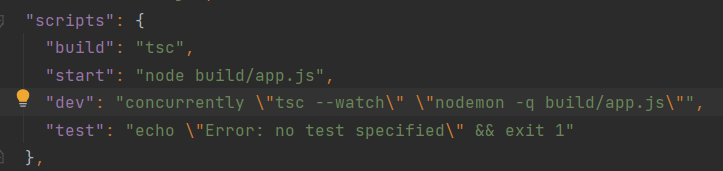

## Heroku End-Point Base Url
- https://reservation-api-v1.herokuapp.com/ 
  - ### End-Points: `mobile/`
    - Auth-User
      - `user/login`
      - `user/register`
      - `user/forgot-password`
      - `user/set-new-password`
    - Auth-Customer
      - `customer/login`
      - `customer/register`
      - `customer/forgot-password`
      - `customer/set-new-password`
    - Store
        - `store/add`
        - `store/list-by-customer-id`
    - User Store
      - `user/store/list`
    - Work
      - `work/add`
      - `work/get-work-list`
    - Reservation
      - `reservation/add`
      - `reservation/get-reservation-list-by-user-id`
      - `reservation/get-reservation-list-by-store-id`
    
### All Method type is `POST`

# Using Typescript and Create a Reservation App

### Typescript Projesi Oluşturma Adımları

**1)** Öncelikle typescript kütüphanesini kurmamız gerekiyor. `npm install -g typescript` komutu ile typescript kütüphanesini bilgisayarımıza global olarak kuruyoruz.

**2)** tsconfig dosyası konfigürasyonu yapılmalıdır. Bir dizinde tsconfig.json dosyasının bulunması, dizinin bir typescript projesinin kökü olduğunu gösterir. `tscongif.json` projeyi derlemek için gereken kök dosyaları ve derleyici seçeneklerini belirtir.

**3)** `tsc –init` komutu yeni bir tscongif.json oluşturmak için kullanılır. Oluşturulan bu tsconfig.json dosyasının içinde derleyiciye uygun bir şekilde varsayılan ayarlar gelir.
   
 
    - Bazı tsconfig özellikleri;
     - target: Derleyicinin çıkaracağı hedef javascript sürümünü belirtmemize izin verir.
     - module: Derlenmiş javascript kodunda bir module yöneticisi kullanmamıza izin verir. (commonjs desteklenir ve node js de bir standartdır)
     - strict: tip denetimi seçeneklerini etkinleştiren bir seçenek.
     - esModuleInterop: es6 modullerini commonjs modüllerine derlememize izin verir.
     - forceConsistentCasingInFileNames: true olarak ayarlanırsa büyük/küçük harf duyarlı dosya adlandırmayı etkinleştirir.
     - outDir: Derlenmiş kodun çıkarılacağı yolu belirtir.
     - rootDir: Derlenecek olan typescript kodunun yolunu gösterir.

**4)** Projeyi derledikten sonra `tsconfig.json` dosyasında belirttiğimiz `outDir` adresinde projenin javascrit haline derlenmiş kodları bulunur. Derlenmiş projeyi çalıştırmak için node `{outDir}/app.js` komutu kullanılır.

**5)** Bu işlemlerin ardından `package.json` dosyasını güncelliyoruz. Öncelikle `npm install -D concurrently nodemon` komutunu kullanarak paketimiz kuruyoruz.

   - Daha sonra `package.json` dosyasını güncelliyoruz.
      

**7)** tsc komutu ile projemizi build ediyoruz. Bu noktada bizim yazdığımız typescript kodları javascript kodlarına derlenecektir. Derlenen kodlar tsconfig.json içinde bulunan outDir klasörü içinde bulunur. 

**8)** start komutu ile derlenen javascript kodunu çalıştırıyoruz.

**9)** Yapılan bu işlemleri her kod değişikliğinde tek tek yapmak maliyetli olacağından dolayı bu işleri otomatize edecek bir script yazıyoruz. Burda kullandığımız concurrently paketi aynı anda birden fazla komut çalıştırmak için kullanıyoruz. nodemon paketini ise kodumuzda bir değişiklik olduğunda bunu algılayıp projeyi yeniden çalıştırmak için kullanıyoruz. dev komutunu çalıştırdığımızda önce yazdığımız typescript kodlarını javascript koduna derleyip daha sonra derlenen bu kodu nodemon ile çalıştırıyoruz.  Bu sayede kodumuzda değişiklik yaptığımızda otomatik olarak proje tekrar çalıştırılacaktır.

### Proje Başlatmak için
- `npm run dev` for build 
- `docker-compose up` for docker compose

    []: # Language: typescript
    []: # Path: src/index.ts
